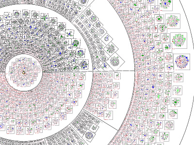

I saw something similar as an undergrad CS student, and I haven't been able to find something similar.
I'm guessing this is what the poster I saw was created from.

This is a set of scripts to create a poster of the Linux kernel
(v1.2 to 2.6 at the moment).  For a 2.6 kernel this will take about
20 min on a 2.2GHz or a simple 5 min for a 2.0 :-)

The current code is much faster than it once was, taking only barely
30 minutes on a 400MHz Celeron machine or ~13 minutes on my 1.2 GHz
Athlon

Thanks to Linuxcare for providing sustenance during coding.

This archive was originally (c) Paul `Rusty' Russell, and placed under the
GPL.  Also (c) Christian Reiniger, Michael Marineau, and other contributors.

To make the poster:
1) make KERNEL_DIR=<<where-your-2.4-kernel-source-is>>

    This will first extract all the functions from the kernel
    source, into a directory called "image/".

    Then it will create a Makefile to generate the final image,
    which it will then run.

    This entire process takes about    30 minutes.

    If you get strange errors (flex buffer overflow or so) that's
    typically caused by source files not adhering to the kernel
    coding style and as a result confusing our "parser". A quick
    fix for this is running the following on your (copy of the)
    kernel source:

    for i in `find $KERNEL_DIR -type d`; do
      indent $i/*.c
    done

    and re-making lgp (using the same $KERNEL_DIR). indent will print
    *many* warnings. I don't know what that means regarding the quality
    of kernel code, but it certeinly doesn't have any negative
    effect on lgp.

2) Run posterize, like so:
    ./posterize a4 6

    The first argument is the paper size (a4, a3, a0, letter or 11x17),
    the second is the size of the poster: this creates a poster of
    6x6 A4 sheets.

    If you are using a 3' plotter that can run any length of page,
    use the paper size 3ft which will set the length of the image.
    For example, to print the poster in two long halves use:
    ./posterize 3ft 2
    NOTE: This requires that your plotter be able to print non standard
    paper sizes.  The one I use cannot, so let me know if this actually
    works with a plotter out there :-)

3) You will now have all the files called poster.1.1.ps.gz to
    poster.6.6.ps.gz.  You will need to print them, something like so:
    for f in poster*.gz; do zcat $f | lpr -; done

4) From the `poster' man page:
    Our  preferred  method  for  the assembly of a poster from
    multiple sheets is as follows:

    - Arrange the sheets in the proper order on a large  table
     or on the floor.

    - Remove  from  all sheets, except from those in the left-
     most column or bottom row, their left and bottom cutmar-
     gin.

    - In left-to-right and bottom-to-top order, glue the right
     (and top) cutmargin and  stick  the  right  (and  upper)
     neighbouring page on top of that.

    - Turn  the  glued-together  poster  face  bottom, and put
     adhesive tape on the sheet edges (on the backside of the
     poster) for more strength.

    - Remove the remaining cutmargin around the poster.

5) If this is all too hard, posters should soon be on sale at:

    http://www.everythinglinux.com.au
    (well, not any more...)

Enjoy your poster!

